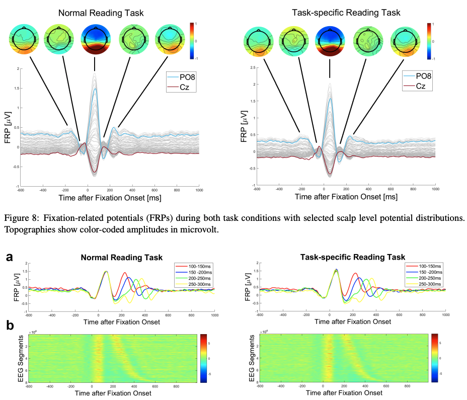
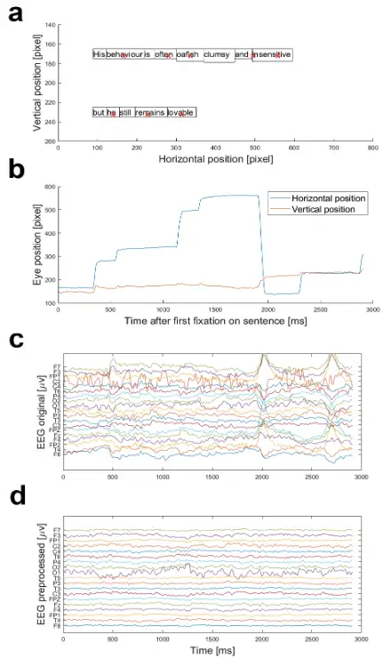

# ZuCo 2.0

<div align="center">
    <a href="https://github.com/openmedlab/"></a>
</div>
<p style="text-align:center;font-size:10px;"><em></em></p>

## Dataset Information

The ZuCo 2.0 dataset is a collection combining high-density EEG (electroencephalography) and eye-tracking data, recorded from 18 healthy adult native English speakers engaged in natural reading and annotation tasks. Participants read 739 English sentences, divided into 349 sentences for normal reading and 390 for task-specific reading, where participants actively searched for semantic relation types as part of a language annotation task.

**Differences and connections between ZuCo 1.0 and ZuCo 2.0:**

1. **Experimental Design:**
   - ZuCo 1.0's design included two normal reading tasks and one task-specific reading task, completed in different sessions at different times, making direct comparisons between natural reading and annotation tasks difficult. 
   - ZuCo 2.0 alternates between normal and task-specific reading within the same experimental session, reducing EEG data variability caused by different testing times and allowing more accurate cognitive difference analysis between natural reading and annotation tasks.

2. **Data Volume and Participants:**
   - ZuCo 2.0 expanded the dataset, including more sentences and participant data—739 sentences from 18 participants, compared to ZuCo 1.0's 1,107 sentences from 12 participants. 
   - ZuCo 2.0 also overlaps some sentences with ZuCo 1.0, enabling comparative analyses across different experimental setups.

3. **Task-Specific Reading:**
   - ZuCo 2.0's task-specific reading (TSR) encourages participants to focus on specific semantic relations (e.g., "political stance" or "profession") during reading and to decide post-reading if these relations are present in the sentences. This design enhances the dataset’s applicability in semantic information extraction tasks, whereas ZuCo 1.0 focused more on general sentiment analysis and relation extraction tasks.

4. **Data Quality:**
   - ZuCo 2.0 includes improvements in data collection and preprocessing, utilizing newer equipment and more refined methods to ensure higher quality EEG and eye-tracking data. These enhancements include automated data cleaning, verification, and advanced feature extraction techniques for better analysis and interpretation of experimental data.

Overall, ZuCo 2.0 builds on ZuCo 1.0 by further expanding and refining experimental design, data volume, and data quality, broadening its applicability in NLP and cognitive science research. Details on the ZuCo 1.0 dataset are also available for reference.

## Dataset Meta Information

| Feature        | Language | EEG Sampling Rate | File Format  | EEG Format  |
|----------------|----------|-------------------|--------------|-------------|
| eeg-to-text    | English  | 500 Hz            | .CSV         | .mat        |


## Dataset Information Statistics

| Task                          | Number of Sentences | Average Words per Sentence  | Number of Words | Number of Fixations | Average Sentence Reading Time (sec) |
|-------------------------------|---------------------|-----------------------------|-----------------|---------------------|-------------------------------------|
| Normal Reading (NR)           | 349                 | 19.6                        | 6828            | 2412                | 4.9                                 |
| Task-Specific Reading (TSR)   | 390                 | 21.3                        | 8310            | 2437                | 4.9                                 |

The table summarizes the reading material statistics and corresponding sentence length and reading speed distributions for the two tasks in the ZuCo 2.0 dataset. The normal reading (NR) task includes 349 sentences, while the task-specific reading (TSR) contains 390 sentences. The average sentence length is 19.6 words for NR and 21.3 words for TSR. Additionally, the higher saccade rate in the task-specific reading reflects participants' focus primarily on identifying specific types of relations rather than comprehensively understanding each sentence.

## Visualization

<div align="center">
    <a href="https://github.com/openmedlab/"></a>
</div>
<p style="text-align:center;font-size:10px;"><em></em></p>

Figure 1 showcases the visualization of eye-tracking and electroencephalogram (EEG) data from a single trial in the ZuCo 2.0 dataset. Figure 1a displays the distribution of gaze points while a participant reads the sentence "His behavior is often oafish, clumsy and insensitive, but he still remains lovable." The red crosses represent the participant's gaze points, indicating where their eyes rested during reading. The boxes around each word illustrate the word boundaries. This distribution helps analyze which words placed a greater cognitive load on the participant, giving insights into their comprehension process.

Figure 1b illustrates the temporal variation of gaze points for the same sentence depicted in Figure 1a. The x-axis represents time since the start of reading the sentence in milliseconds, and the y-axis represents changes in the participant's eye position on the screen in pixels. The blue curve shows horizontal eye movements, and the red curve shows vertical movements. This graph allows observation of how the participant moved their gaze across the screen during reading and which words required more gaze time.

Figure 1c presents the raw EEG data recorded while the participant read the same sentence. Each line represents the brain activity recorded by an EEG sensor, with the y-axis in microvolts (μV) and the x-axis in milliseconds. The raw EEG data contains significant noise and fluctuations, which could interfere with direct analysis, hence necessitating further preprocessing.

Figure 1d shows the results after preprocessing the raw EEG data from Figure 1c. After preprocessing, noise in the EEG data is effectively filtered out, making the signals smoother and clearer. The preprocessed EEG data are better suited for further analysis, such as extracting features related to language processing, which are valuable for training and evaluating machine learning models.

## File Structure

``` 
/ZuCo2.0
│
├── answers
│   ├── Fullresults_TSR_YAC.mat
│   ├── Fullresults_TSR_YAG.mat
│   ├── Fullresults_TSR_YAK.mat
│   └── ...
│   - Contains the full result files for each participant in the Task-Specific Reading (TSR).
│
├── scripts
│
├── task_materials
│   ├── relations_labels_task2.csv
│   ├── relations_labels_task3.csv
│   └── ...
│   - Contains label files for Task-Specific Reading and Normal Reading.
│
│   ├── task1- NR
│   │   ├── Matlab files
│   │   │   ├── resultsYAC_NR.mat
│   │   │   ├── resultsYAG_NR.mat
│   │   │   ├── resultsYAK_NR.mat
│   │   │   └── ...
│   │   │   - Contains result files for each participant in the Normal Reading (NR) task.
│   │   │
│   │   ├── Preprocessed
│   │   │   ├── YAC
│   │   │   ├── YAG
│   │   │   │   ├── gip_YAG_NR6_EEG.mat
│   │   │   │   ├── gip_YAG_NR7_EEG.mat
│   │   │   │   ├── gip_YAG_NR8_EEG.mat
│   │   │   │   ├── gip_YAG_NR1_EEG.mat
│   │   │   │   └── ...
│   │   │   ├── YAK
│   │   │   ├── YDG
│   │   │   ├── YDR
│   │   │   ├── YFR
│   │   │   ├── YFS
│   │   │   ├── YHS
│   │   │   ├── YIS
│   │   │   └── ...
│   │   │   - Contains the preprocessed EEG data files for each participant.
│   │   │
│   │   ├── sentencesNR.mat
│   │   └── sentiment_normal_reading.csv
│   │   - Contains sentence information and sentiment labels for the Normal Reading task.
│   │
│   ├── Raw data
│   │   └── normal_reading.csv
│   │   - Raw data files.
│
├── task2 - TSR
│
```

## Authors and Institutions

Nora Hollenstein (ETH Zurich)

Marius Troendle (University of Zurich)

Ce Zhang (ETH Zurich)

Nicolas Langer (University of Zurich)

## Source Information

Official Website: https://osf.io/2urht/

Download Link: https://osf.io/2urht/

Article Address: https://arxiv.org/pdf/1912.00903

Publication Date: 2019-12

## Citation

``` 
@article{hollenstein2019zuco,
  title={ZuCo 2.0: A dataset of physiological recordings during natural reading and annotation},
  author={Hollenstein, Nora and Troendle, Marius and Zhang, Ce and Langer, Nicolas},
  journal={arXiv preprint arXiv:1912.00903},
  year={2019}
}
```

Original introduction article is [here](https://zhuanlan.zhihu.com/p/717572595).