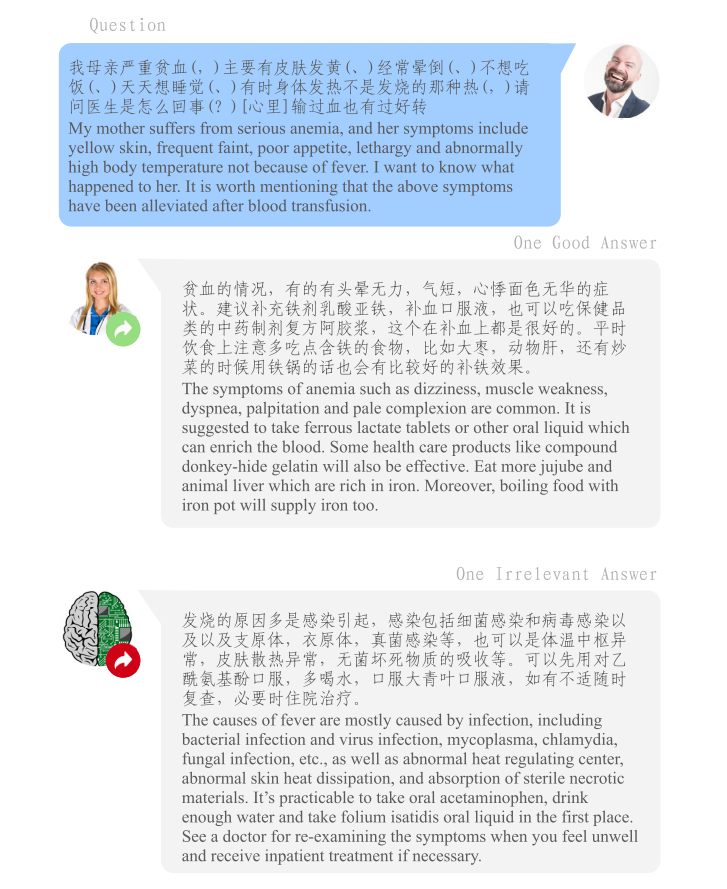

# cMedQA v2.0

<div align="center">
    <a href="https://github.com/openmedlab/"></a>
</div>
<p style="text-align:center;font-size:10px;"><em></em></p>

## Dataset Information

cMedQA v2.0 is a dataset designed for Chinese medical question-answering tasks, aimed at supporting and advancing research in automated question-answering systems within the medical and healthcare domain. This dataset offers a large number of medically related questions and answer pairs by updating and expanding its content, covering a wide range of knowledge in the fields of diseases, symptoms, treatment methods, and other health-related areas. cMedQA v2.0 pays special attention to the linguistic characteristics of the Chinese language and the complexity of medical professional knowledge, providing a rich resource for the training and validation of deep learning models.

The development and application of the cMedQA v2.0 dataset are of significant importance for improving the accuracy and efficiency of Chinese medical question-answering systems. It not only facilitates the dissemination of medical information and communication between doctors and patients but also offers researchers a platform to explore and experiment with advanced deep learning technologies in the processing of Chinese medical texts. Through this dataset, researchers can develop more accurate and faster response automated question-answering models, thereby enhancing the service quality and user experience of online medical communities.


## Dataset Meta Information

| Task Type | Language | Train | Val   | Test | File Format | Size |
|-----------|----------|-------|-------|------|--------|------|
| QA        | Chinese  | 100,000   | 4000  | 4000 | .csv   | 63.9MB |


## Dataset Information Statistics

|               | #Question | #Answer | Ave. #Character Per Question | Ave. #Character Per Answer |
|---------------|-----------|---------|------------------------------|----------------------------|
| Training      | 100,000   | 188,490 | 48                           | 101                        |
| Development   | 4,000     | 7,527   | 49                           | 101                        |
| Test          | 4,000     | 7,552   | 49                           | 100                        |
| Total         | 108,000   | 203,569 | 49                           | 101                        |

Table 1: The statistics of cMedQA v2.0 dataset. Ave: abbreviation for average."#" denotes "the number of".


## Dataset Example

<div align="center">
    <a href="https://github.com/openmedlab/"></a>
</div>
<p style="text-align:center;font-size:10px;"><em></em></p>

## File Structure

The structure of the dataset is as follows: `question.zip` and `answer.zip` contain all the questions and answers, respectively. The files `train_candidates.zip`, `dev_candidates.zip`, and `test_candidates.zip` correspond to the divisions for the training set, validation set, and test set, respectively.

``` 
.
|
├── question.zip
├── answer.zip
├── train_candidates.zip, 
├── test_candidates.zip
└── dev_candidates.zip
```

## Authors and Institutions

SHENG ZHANG  (School of Systems Engineering, National University of Defense Technology)

XIN ZHANG (School of Systems Engineering, National University of Defense Technology)

HUI WANG (School of Systems Engineering, National University of Defense Technology)

LIXIANG GUO (School of Systems Engineering, National University of Defense Technology)

SHANSHAN LIU  (School of Systems Engineering, National University of Defense Technology)


## Source Information

Official Website: https://github.com/zhangsheng93/cMedQA2

Download Link: https://github.com/zhangsheng93/cMedQA2

Article Address: https://ieeexplore.ieee.org/abstract/document/8548603

Publication Date: 2018.12

## Citation

``` 
@ARTICLE{8548603,
  author={Zhang, Sheng and Zhang, Xin and Wang, Hui and Guo, Lixiang and Liu, Shanshan},
  journal={IEEE Access}, 
  title={Multi-Scale Attentive Interaction Networks for Chinese Medical Question Answer Selection}, 
  year={2018},
  volume={6},
  number={},
  pages={74061-74071},
  keywords={Biomedical imaging;Data mining;Semantics;Medical services;Feature extraction;Knowledge discovery;Medical question answering;interactive attention;deep learning;deep neural networks},
  doi={10.1109/ACCESS.2018.2883637}}
```

Original introduction article is [here](https://zhuanlan.zhihu.com/p/684802462).