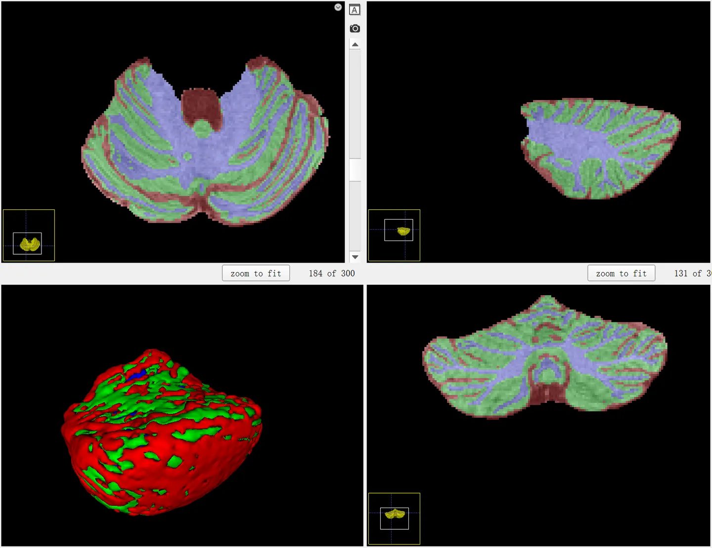
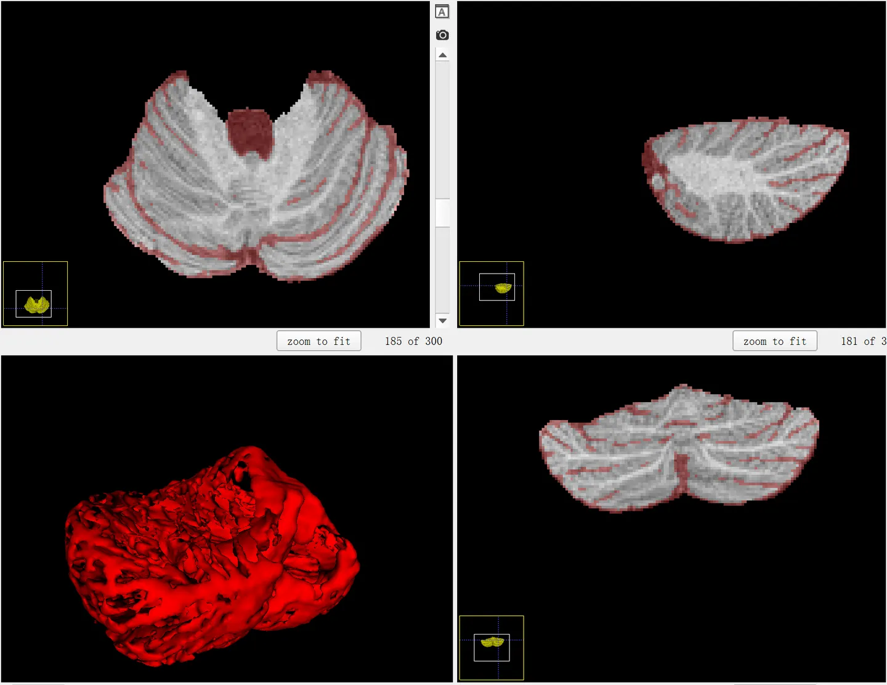
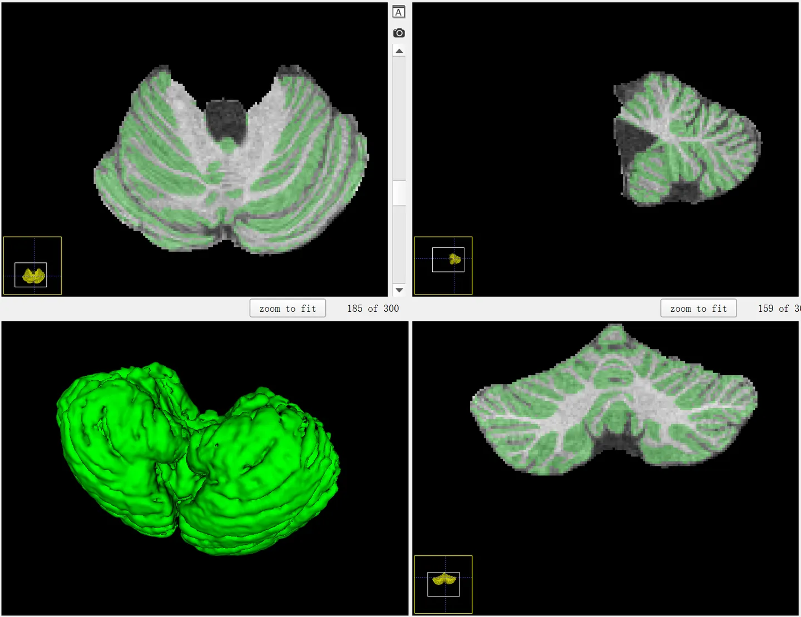
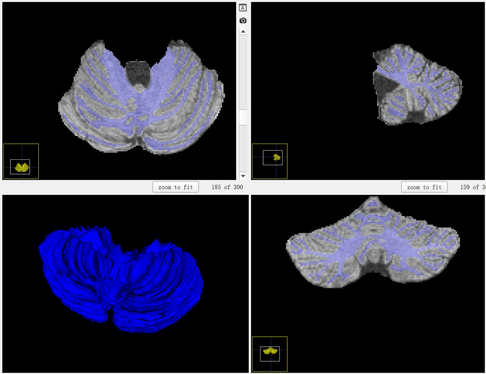

# cSeg 2022
<div align="center">
    <a href="https://github.com/openmedlab/"></a>
</div>
<p style="text-align:center;font-size:10px;"><em></em></p>

## Dataset Information

cSeg2022 is a dataset focused on the segmentation of T1-weighted MRI images of 24-month-old infants, specifically targeting the detailed segmentation of the cerebellar structure. Compared to other brain segmentation datasets, cSeg2022 is quite similar to iSeg, which was initiated by the University of North Carolina at Chapel Hill in 2017 (both involve complete segmentation of brain structures and both categorize into cerebrospinal fluid, grey matter, and white matter). The important difference is that this dataset focuses only on cerebellar structures, and the chosen subjects are 24-month-old infants. Clinically, this task does not have significant differences; overall, it can be used as a supplemental dataset to iSeg or in specific cerebellar research.

In medical image segmentation, the study of brain structures is particularly crucial, with the significance of infant brain structure research being self-evident. The cerebellum is a key brain structure that develops rapidly during the early postnatal stages of infants, and its accurate segmentation into white matter, grey matter, and cerebrospinal fluid is vital for revealing the early development process of the cerebellum. However, compared to the adult cerebellum, segmentation studies for the infant cerebellum are noticeably lacking. Given the extremely low tissue contrast and severe partial volume effects in infant cerebellum MRI, both manual and automatic segmentation face significant challenges.
## Dataset Meta Information

You can write down meta information about the dataset, take TotalSegmentator for example, it could be:

| Dimensions | Modality | Task Type | Anatomical Structures          | Anatomical Area | Number of Categories | Data Volume | File Format |
|------------|---------|-----------|--------------------------------|-----------------|----------------------|-------------|-------------|
| 3D         | MR      | Segmentation | Cerebrospinal fluid, grey matter, white matter. | Brain           | 3                    | 13          | .nii.gz     |


### Resolution Details

You can also write down the resolution details such as size (x, y, z) and spacing information about the dataset.

For example:

| Dataset Statistics | spacing (mm)     | size            |
|--------------------|------------------|-----------------|
| min                | (0.80, 0.80, 0.80)	              | (300, 300, 300)     |
| median             | (0.80, 0.80, 0.80)	           | (300, 300, 300) |
| max                | (0.80, 0.80, 0.80)	              | (300, 300, 300) |

## Label Information Statistics

| Anatomical Structure | Cerebrospinal Fluid | Gray Matter | White Matter |
|----------------------|---------------------|-------------|--------------|
| Cases                | 13                  | 13          | 13           |
| Coverage             | 100%                | 100%        | 100%         |
| Mean Volume (cm³)    | 22                  | 50          | 31           |
| Median Volume (cm³)  | 27                  | 67          | 36           |
| Max Volume (cm³)     | 34                  | 81          | 49           |


## Visualization

<div align="center">
    <a href="https://github.com/openmedlab/"></a>
</div>
<p style="text-align:center;font-size:10px;"><em> Full structure visualization.</em></p>

<div align="center">
    <a href="https://github.com/openmedlab/"></a>
</div>
<p style="text-align:center;font-size:10px;"><em> Cerebrospinal fluid visualization.</em></p>

<div align="center">
    <a href="https://github.com/openmedlab/"></a>
</div>
<p style="text-align:center;font-size:10px;"><em> Grey matter visualization.</em></p>

<div align="center">
    <a href="https://github.com/openmedlab/"></a>
</div>
<p style="text-align:center;font-size:10px;"><em> White matter visualization.</em></p>

## File Structure

The dataset file structure is as follows, following the nnU-Net style of data organization, containing 'imagesTr' and 'labelsTr' folders for storing images and labels, respectively:

``` 
cSeg-2022
├── imagesTr
│   ├── subject-1.nii.gz
│   ├── ...
│   ├── subject-13.nii.gz
├── labelsTr
│   ├── subject-1.nii.gz
│   ├── ...
│   ├── subject-13.nii.gz
├── dataset.json
```

## Authors and Institutions

Yue Sun (University of North Carolina at Chapel Hill)

Limei Wang (University of North Carolina at Chapel Hill)

Dr. Li Wang (University of North Carolina at Chapel Hill)

Dr. Gang Li (University of North Carolina at Chapel Hill)

Dr. Valerie Jewells (University of North Carolina at Chapel Hill)

Dr. Ian H. Gotlib (Stanford University)

Dr. Kathryn Leigh Humphreys (Vanderbilt University)

Dr. Weili Lin (University of North Carolina at Chapel Hill)


## Source Information

Official Website: https://tarheels.live/cseg2022/

Download Link: https://tarheels.live/cseg2022/data/

Article Address: TBD

Publication Date: April, 2022.

## Citation

``` 
TBD
```

Original introduction article is [here](https://zhuanlan.zhihu.com/p/672375310).