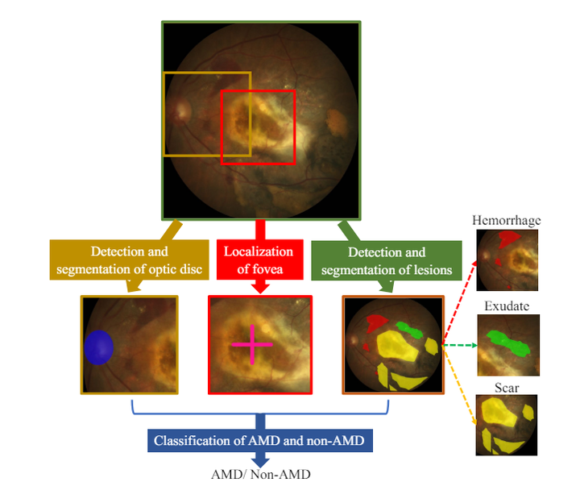
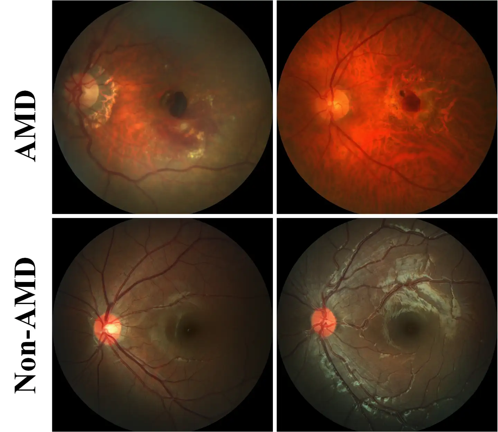

# iChallenge-ADAM-Task1

<div align="center">
    <a href="https://github.com/openmedlab/"></a>
</div>
<p style="text-align:center;font-size:10px;"><em></em></p>

## Dataset Information

The primary goal of the ADAM Challenge is to research and develop algorithms related to the diagnosis of Age-Related Macular Degeneration (AMD) and to segment lesions in fundus photographs of AMD patients. This challenge aims to enhance the detection capability of AMD by evaluating and comparing automated algorithms on a common dataset of retinal fundus images. In Task 1, the organizers provide a training set containing 400 images to determine whether AMD is present, as well as a test set of 400 unlabeled images. Participants need to develop algorithms to accurately identify AMD and non-AMD fundus images.

The etiology of AMD is not completely understood and may involve multiple factors, including genetic factors, the damaging effects of long-term light exposure, and poor nutrition. AMD can be divided into two types: dry AMD and wet AMD. Dry AMD (also known as non-exudative AMD) does not involve the formation of new blood vessels. It is characterized by the gradual atrophy of the retinal pigment epithelium (RPE). In the late stages, drusen and large areas of atrophy can be observed through fundus images. Wet AMD (also known as exudative or neovascular AMD) is characterized by the formation of active abnormal new blood vessels under the RPE, leading to exudation, bleeding, and scarring. Without timely treatment, wet AMD can cause irreversible photoreceptor damage and rapid vision loss. Through the ADAM Challenge, researchers and developers aim to improve diagnostic and lesion segmentation techniques for AMD, enhancing the accuracy of early detection and intervention, thereby better managing and treating AMD patients, helping them maintain good vision and quality of life.

## Dataset Meta Information

| Dimensions | Modality | Task Type      | Anatomical Structures | Anatomical Area | Number of Categories | Data Volume | File Format |
|------------|----------|----------------|-----------------------|-----------------|----------------------|-------------|-------------|
| 2D         | Fundus       | Classification | Eye                   | Eye             | 2                    | train/test:400/400        | JPG         |


### Resolution Details

| Dataset Statistics | size             |
|--------------------|------------------|
| min                | (1444, 1444, 3)  |
| medium             | (1860, 1906, 3)  |
| max                | (2056, 2124, 3)  |

## Label Information Statistics

| Categories | Number |
|------------|--------|
| AMD        | 89     |
| Non-AMD    | 311    |

## Visualization

<div align="center">
    <a href="https://github.com/openmedlab/"></a>
</div>
<p style="text-align:center;font-size:10px;"><em>Paper Example.</em></p>

<div align="center">
    <a href="https://github.com/openmedlab/"></a>
</div>
<p style="text-align:center;font-size:10px;"><em> Local Visualization.</em></p>

## File Structure

The file structure of the dataset is as follows: `images` are stored in images, and the annotations of `train` and `test` are given in `txt` format.

``` 
ADAM
├── images
│   ├── xxx.jpg
│   ├── xxx.jpg
│   │    ...
├── train.txt
├── test.txt
```

## Authors and Institutions

Huihui Fang (Intelligent Healthcare Unit, Baidu Inc., Beijing, China.)

Fei Li (State Key Laboratory of Ophthalmology, Zhongshan Ophthalmic Center)

## Source Information

Official Website: https://amd.grand-challenge.org/Home/

Download Link: https://amd.grand-challenge.org/download/

Article Address: https://arxiv.org/pdf/2202.07983

Publication Date: 2022

## Citation

``` 
@article{fang2022adam,
  title={Adam challenge: Detecting age-related macular degeneration from fundus images},
  author={Fang, Huihui and Li, Fei and Fu, Huazhu and Sun, Xu and Cao, Xingxing and Lin, Fengbin and Son, Jaemin and Kim, Sunho and Quellec, Gwenole and Matta, Sarah and others},
  journal={IEEE transactions on medical imaging},
  volume={41},
  number={10},
  pages={2828--2847},
  year={2022},
  publisher={IEEE}
}
```

Original introduction article is [here](https://zhuanlan.zhihu.com/p/700526564).