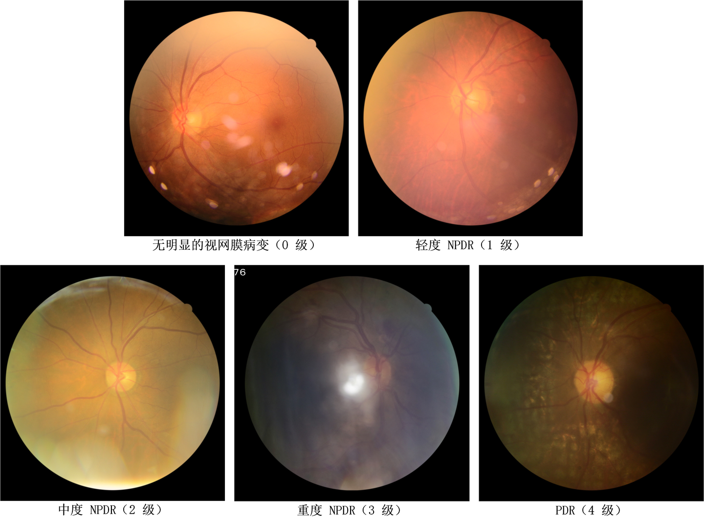

# iChallenge-DeepDRiD-Task1

<div align="center">
    <a href="https://github.com/openmedlab/"></a>
</div>
<p style="text-align:center;font-size:10px;"><em></em></p>

## Dataset Information

Diabetic retinopathy (DR) is the most common disease caused by diabetes. This challenge aims to address real-world problems encountered in designing automatic DR screening systems to advance the technology in this field. The DeepDRiD dataset includes three sub-challenges: (1) regular fundus DR grading for images of varying quality, (2) usability image quality assessment, and (3) ultra-wide field (UWF) DR grading for images from different devices. This paper focuses on Sub-challenge 1. The dataset followed the procedures below to ensure the accuracy of image quality and lesion diagnostic labels. The original retinal images were uploaded to an online platform, and images of each eye were independently assigned to two certified ophthalmologists. They labeled the images using an online reading platform, providing image quality assessment scores and DR grading diagnoses. When diagnostic results were inconsistent, a third ophthalmologist, serving as the senior supervisor, confirmed or corrected the diagnosis. The final grading outcome depended on consensus among the three ophthalmologists. Clinically, DR is classified into five levels based on the International Clinical Diabetic Retinopathy (ICDR) 4-scale classification: (1) No apparent retinopathy (Grade 0), (2) Mild NPDR (Grade 1), (3) Moderate NPDR (Grade 2), (4) Severe NPDR (Grade 3), and (5) PDR (Grade 4).

## Dataset Meta Information

| Dimensions | Modality | Task Type      | Anatomical Structures | Anatomical Area | Number of Categories | Data Volume | File Format |
|------------|----------|----------------|-----------------------|-----------------|----------------------|-------------|-------------|
| 2D         | Fundus   | Classification | Eye                   | Eye             | 5                    | -           | JPG         |


### Resolution Details

| Dataset Statistics | size             |
|--------------------|------------------|
| min                | (1725, 1592, 3)  |
| median             | (1878, 1827, 3)  |
| max                | (2232, 1592, 3)  |

## Label Information Statistics

| Label                             | Quantity |
|-----------------------------------|----------|
| No apparent retinopathy (Grade 0) | 834      |
| Mild NPDR (Grade 1)               | 264      |
| Moderate NPDR (Grade 2)           | 394      |
| Severe NPDR (Grade 3)             | 378      |
| PDR (Grade 4)                     | 130      |

## Visualization

<div align="center">
    <a href="https://github.com/openmedlab/"></a>
</div>
<p style="text-align:center;font-size:10px;"><em>Local Visualization.</em></p>

## File Structure

The file structure of the dataset is as follows:

``` 
.
├── regular_fundus_images
│   ├── Online-Challenge1&2-Evaluation
│   │   ├── Challenge1_upload.csv
│   │   ├── Challenge2_upload.csv
│   │   ├── Challenge1_labels.xlsx
│   │   ├── Challenge1_labels.xlsx
│   │   ├── Images
│   │   └── Readme.docx
│   ├── regular-fundus-training
│   │   ├── Images
│   │   ├── Readme.docx
│   │   └── regular-fundus-training.csv
│   └── regular-fundus-validation
│       ├── Images
│       ├── Readme.docx
│       └── regular-fundus-validation.csv
└── ultra-widefield_images
    ├── Online-Challenge3-Evaluation
    │   ├── Challenge3_upload.csv
    │   ├── Challenge3_labels.xlsx
    │   ├── Images
    │   └── Readme.docx
    ├── ultra-widefield-training
    │   ├── Images
    │   ├── Readme.txt
    │   └── ultra-widefield-training.csv
    └── ultra-widefield-validation
        ├── Images
        ├── Readme.txt
        └── ultra-widefield-validation.csv
```

## Authors and Institutions

Huihui Fang (Intelligent Healthcare Unit, Baidu Inc., Beijing, China.)

Fei Li (State Key Laboratory of Ophthalmology, Zhongshan Ophthalmic Center)

## Source Information

Official Website: https://github.com/deepdrdoc/DeepDRiD

Download Link: https://github.com/deepdrdoc/DeepDRiD

Article Address: https://doi.org/10.1016/j.patter.2022.100512

Publication Date: 2022

## Citation

``` 
@misc{liu2022deepdrid,
  title={DeepDRiD: diabetic retinopathy-grading and image quality estimation challenge. Patterns 3 (6), 100512 (2022)},
  author={Liu, R and Wang, X and Wu, Q and Dai, L and Fang, X and Yan, T and Son, J and Tang, S and Li, J and Gao, Z and others},
  year={2022}
}
```

Original introduction article is [here](https://zhuanlan.zhihu.com/p/894527843).
