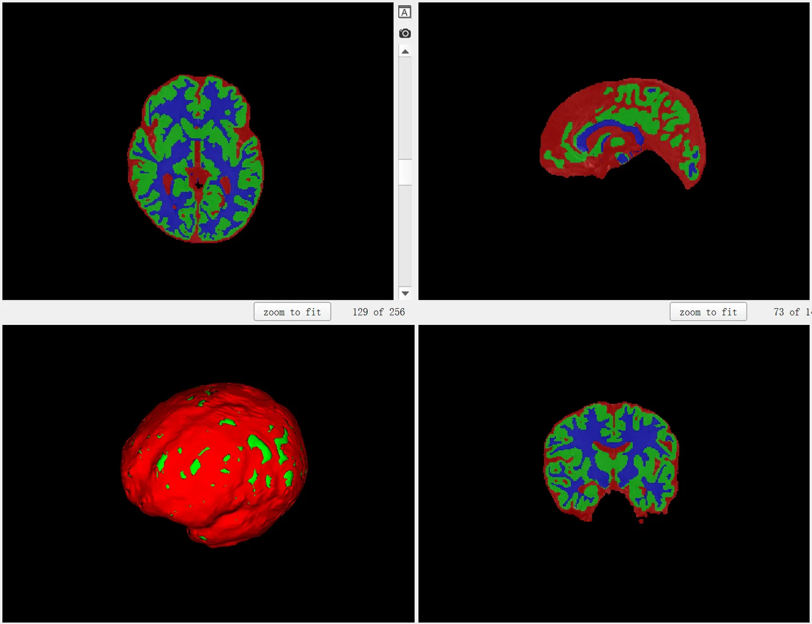
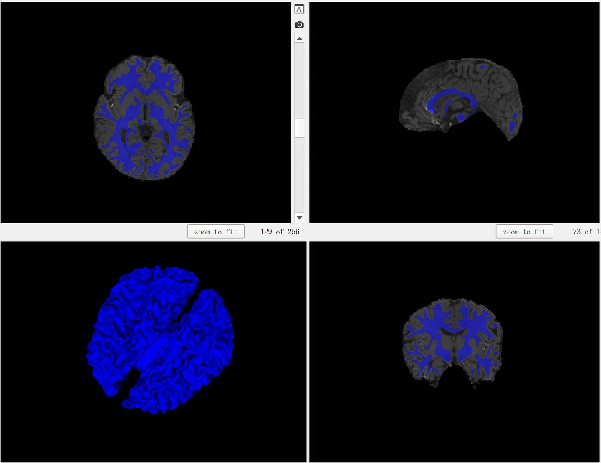

# iSeg

iSeg was hosted by the Developing Brain Computing Lab at the University of North Carolina at Chapel Hill during the 
MICCAI conferences in 2017 and 2019. Starting in 2017, they provided data for 10 training subjects and 13 test 
subjects selected from multiple visits to the Multimodal Advanced Pediatric (MAP) brain imaging study. Despite having only 10 cases, this data set includes high-quality full-brain structural segmentation, which can provide some reference for research related to infant brain structures. Due to the limited amount of data, it is generally more suitable as a test set to test the out-of-domain generalization capabilities of brain structures and can be used as a challenging test task.

The segmentation of brain structures is an important task in medical image segmentation. Traditional benchmark datasets for brain structure segmentation often focus on the segmentation of specific targets, such as [BraTS21](https://www.med.upenn.edu/cbica/brats/) mainly concentrating on brain tumor segmentation and [MSD](http://medicaldecathlon.com/) Hippocampus focusing on the segmentation of the hippocampus. In recent years, the segmentation task of infant brain structures has received increasing attention. Infants are at a critical stage of brain development, and accurately segmenting infant brain MRI images into white matter, grey matter, and cerebrospinal fluid is very important for studying normal and abnormal early brain development. Around the age of 6 months, the voxel intensity ranges of grey and white matter in structural MRI images largely overlap (especially near cortical regions), resulting in lower tissue contrast, which creates greater challenges for infant brain tissue segmentation.

## Dataset Information

This part is introduction and summarization of the dataset.

## Dataset Meta Information

| Dimensions | Modality | Task Type | Anatomical Structures         | Anatomical Area | Number of Categories | Data Volume | File Format |
|------------|----------|-----------|-------------------------------|-----------------|----------------------|-------------|-------------|
| 3D         | MRI      | Segmentation | Cerebrospinal fluid, grey matter, white matter. | Brain           | 3                    | 23          | .nii.gz     |


### Resolution Details

| Dataset Statistics | spacing (mm)    | size            |
|--------------------|-----------------|-----------------|
| min                | (1.0, 1.0, 1.0) | (144, 192, 256) |
| median             | (1.0, 1.0, 1.0) | (144, 192, 256) |
| max                | (1.0, 1.0, 1.0) | (144, 192, 256) |

Number of two-dimensional slices in the dataset: 2560 (based on statistics from 10 training cases).

## Label Information Statistics

| Anatomical Structure | Cerebrospinal Fluid | Gray Matter | White Matter |
|----------------------|---------------------|-------------|--------------|
| Cases                | 10                  | 10          | 10           |
| Coverage             | 100%                | 100%        | 100%         |
| Mean Volume (cm³)    | 147                 | 297         | 178          |
| Median Volume (cm³)  | 178                 | 376         | 242          |
| Max Volume (cm³)     | 201                 | 427         | 308          |


## Visualization

<div align="center">
    <a href="https://github.com/openmedlab/"></a>
</div>
<p style="text-align:center;font-size:10px;"><em> Fully Structure Visualization </em></p>

<div align="center">
    <a href="https://github.com/openmedlab/"></a>
</div>
<p style="text-align:center;font-size:10px;"><em> Cerebrospinal Fluid Visualization </em></p>

<div align="center">
    <a href="https://github.com/openmedlab/"></a>
</div>
<p style="text-align:center;font-size:10px;"><em> Grey Matter Visualization </em></p>

<div align="center">
    <a href="https://github.com/openmedlab/"></a>
</div>
<p style="text-align:center;font-size:10px;"><em> White Matter Visualization </em></p>

## File Structure

The dataset file structure is as follows, following the nnU-Net style of data organization, containing folders named 'imagesTr' and 'labelsTr' for storing images and labels, respectively:

``` 
iSeg
├── imagesTr
│   ├── subject-1.nii.gz
│   ├── ...
│   ├── subject-10.nii.gz
├── labelsTr
│   ├── subject-1.nii.gz
│   ├── ...
│   ├── subject-10.nii.gz
├── dataset.json
```

## Authors and Institutions

Dr. Li Wang (University of North Carolina at Chapel Hill)
Dr. Toan Duc Bui (University of North Carolina at Chapel Hill)
Dr. Gang Li (University of North Carolina at Chapel Hill)
Dr. Weili Lin (University of North Carolina at Chapel Hill)
Dr. Dinggang Shen (University of North Carolina at Chapel Hill)

## Source Information

Official Website: https://iseg2019.web.unc.edu/

Download Link: https://iseg2019.web.unc.edu/

Article Address: https://doi.org/10.1109/TMI.2021.3055428

Publication Date: June, 2019

## Citation

``` 
@ARTICLE{9339962,
  author={Sun, Yue and Gao, Kun and Wu, Zhengwang and Li, Guannan and Zong, Xiaopeng and Lei, Zhihao and Wei, Ying and Ma, Jun and Yang, Xiaoping and Feng, Xue and Zhao, Li and Le Phan, Trung and Shin, Jitae and Zhong, Tao and Zhang, Yu and Yu, Lequan and Li, Caizi and Basnet, Ramesh and Ahmad, M. Omair and Swamy, M. N. S. and Ma, Wenao and Dou, Qi and Bui, Toan Duc and Noguera, Camilo Bermudez and Landman, Bennett and Gotlib, Ian H. and Humphreys, Kathryn L. and Shultz, Sarah and Li, Longchuan and Niu, Sijie and Lin, Weili and Jewells, Valerie and Shen, Dinggang and Li, Gang and Wang, Li},
  journal={IEEE Transactions on Medical Imaging}, 
  title={Multi-Site Infant Brain Segmentation Algorithms: The iSeg-2019 Challenge}, 
  year={2021},
  volume={40},
  number={5},
  pages={1363-1376},
  doi={10.1109/TMI.2021.3055428}}
```


Original introduction article is [here](https://zhuanlan.zhihu.com/p/672360580).
