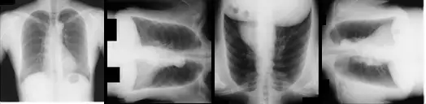

# jsrt-directions

<div align="center">
    <a href="https://github.com/openmedlab/"></a>
</div>
<p style="text-align:center;font-size:10px;"><em></em></p>

## Dataset Information


The jsrt-directions dataset is an X-ray modality classification dataset. It contains a total of 988 data instances, with 948 instances serving as the training set, providing images and labels, and 40 instances as the validation set, providing only images.

Correctly determining the orientation of X-ray images is crucial in clinical diagnosis. The accurate recognition of X-ray images and their orientation by medical AI is essential; incorrect judgments could lead to misdiagnoses, affecting diagnostic outcomes and subsequent treatment plans. An automated system for determining X-ray image orientation can help correct image orientations for AI, significantly enhancing the efficiency and accuracy of image diagnostics and ensuring the accuracy of medical AI in diagnosis and analysis.

This dataset provides researchers with abundant annotated data for training and evaluating the performance of machine learning models. Through research on this dataset, researchers can develop more accurate and efficient automated algorithms for X-ray image orientation determination. This contributes to enhancing the analytical capabilities of medical AI and provides a reliable auxiliary tool for clinical diagnosis.

## Dataset Meta Information

| Dimensions | Modality | Task Type                                        | Anatomical Structures | Anatomical Area | Number of Categories | Data Volume | File Format |
|------------|----------|--------------------------------------------------|-----------------------|-----------------|----------------------|-------------|-------------|
| 2D         | X-ray    | Classification(Determine the Direction of X-ray) | Lung                  | Chest           | 4                    | 988         | PNG         |


### Resolution Details

| Dataset Statistics | size        |
|--------------------|-------------|
| min                | (128, 128)  |
| median             | (128, 128)  |
| max                | (128, 128)  |

| Direction | Up                      | Down                    | Left                    | Right                   |
|-----------|-------------------------|-------------------------|-------------------------|-------------------------|
| Data Count| 237 (train) + 10 (test) | 237 (train) + 10 (test) | 237 (train) + 10 (test) | 237 (train) + 10 (test) |
| Percentage| 25%                     | 25%                     | 25%                     | 25%                     |


## Visualization

<div align="center">
    <a href="https://github.com/openmedlab/"></a>
</div>
<p style="text-align:center;font-size:10px;"><em>From left to right, they are: up, right, down, left.</em></p>

## File Structure

``` 
Dataset
│
├── test
│   ├── down
│   │   ├── 1.png
│   │   ├── 2.png
│   │   ├── ....
│   ├── left
│   │   ├── 1.png
│   │   ├── 2.png
│   │   ├── ....
│   ├── right
│   │   ├── 1.png
│   │   ├── 2.png
│   │   ├── ....
│   ├── up
│   │   ├── 1.png
│   │   ├── 2.png
│   │   ├── ....
├── train
│   ├── down
│   │   ├── 0.png
│   │   ├── 1.png
│   │   ├── ....
│   ├── left
│   │   ├── 0.png
│   │   ├── 1.png
│   │   ├── ....
│   ├── right
│   │   ├── 0.png
│   │   ├── 1.png
│   │   ├── ....
│   ├── up
│   │   ├── 0.png
│   │   ├── 1.png
│   │   ├── ....
├── list_test.txt
├── list_train.txt
```

## Authors and Institutions

- Junji Shiraishi (Department of Radiology, Osaka City University Hospital)
- Shigehiko Katsuragawa (Department of Radiology, Iwate Medical University)
- Junpei Ikezoe (Department of Radiology, Ehime University)
- Tsuneo Matsumoto (Department of Radiology, Yamaguchi University)
- Takeshi Kobayashi (Department of Radiology, Kanazawa University)
- Ken-ichi Komatsu (Toshiba Medical Engineering Division)
- Mitate Matsui (Konica Medical Imaging Department)
- Hiroshi Fujita (Department of Information Sciences, Faculty of Engineering, Gifu University)
- Yoshie Kodera (Department of Radiological Technology, School of Health Sciences, Nagoya University)
- Kunio Doi (Kurt Rossmann Laboratories for Radiologic Image Research, Department of Radiology, University of Chicago)

## Source Information

Official Website: http://imgcom.jsrt.or.jp/minijsrtdb/

Download Link: http://imgcom.jsrt.or.jp/minijsrtdb/

Article Address: https://ajronline.org/doi/full/10.2214/ajr.174.1.1740071

Publication Date: 2000-01

## Citation

``` 
@article{shiraishi2000development,
  title={Development of a digital image database for chest radiographs with and without a lung nodule: receiver operating characteristic analysis of radiologists' detection of pulmonary nodules},
  author={Shiraishi, Junji and Katsuragawa, Shigehiko and Ikezoe, Junpei and Matsumoto, Tsuneo and Kobayashi, Takeshi and Komatsu, Ken-ichi and Matsui, Mitate and Fujita, Hiroshi and Kodera, Yoshie and Doi, Kunio},
  journal={American journal of roentgenology},
  volume={174},
  number={1},
  pages={71--74},
  year={2000},
  publisher={Am Roentgen Ray Soc}
}
```

Original introduction article is [here](https://zhuanlan.zhihu.com/p/709791458).