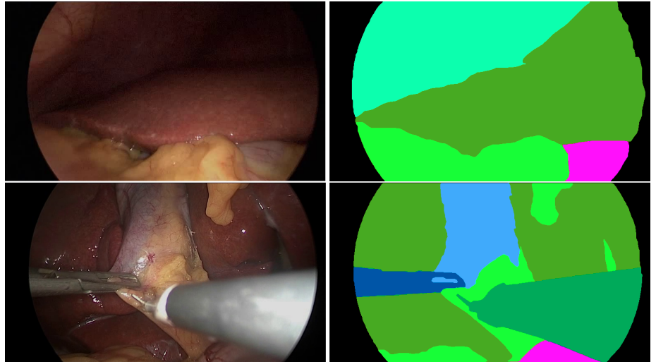
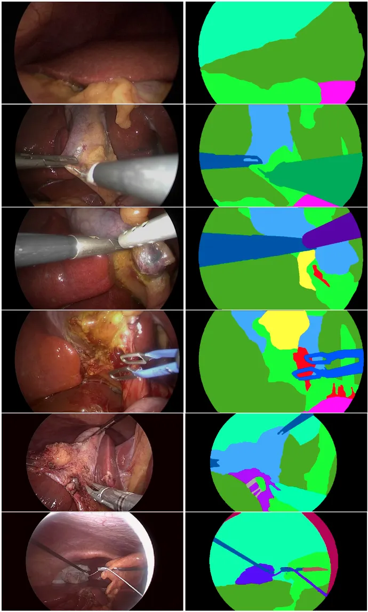

# m2caiseg

<div align="center">
    <a href="https://github.com/openmedlab/"></a>
</div>
<p style="text-align:center;font-size:10px;"><em></em></p>

## Dataset Information

The m2caiSeg dataset is designed for segmentation of endoscopic images during surgical procedures. It is derived from videos 1 and 2 of the MICCAI 2016 Surgical Tool Detection dataset, from which a total of 307 images were sampled and annotated in more detail at the pixel level. The official dataset is divided into 245 training images and 62 test images. The images in the dataset cover a variety of categories and subcategories, including organs such as the liver, gallbladder, top wall, intestines; surgical tools such as clips, bipolar, hooks, scissors, trimmers; as well as fluids like bile and blood. Additionally, there are two special category labels, unknown and black, used to deal with areas that are obscured by certain tools in some images.

In the field of medical AI, especially in the automation of laparoscopic surgeries, although existing surgical robot technologies are advanced, they still rely on a high degree of expertise and skill. For further automation of surgeries, precise identification and annotation of structures and tools in surgical videos are particularly crucial. Overall, the m2caiSeg dataset provides researchers with a rich and well-annotated resource for analyzing and identifying various structures and tools during surgeries.

## Dataset Meta Information

| Dimensions | Modality  | Task Type | Anatomical Structures | Anatomical Area | Number of Categories | Data Volume | File Format |
|------------|-----------|-----------|-----------------------|-----------------|----------------------|-------------|-------------|
| 2D         | Endoscopy | Segmentation | abdominal cavity                 | abdominal cavity           | 19                   | 307         | jpg, png    |


### Resolution Details

| Dataset Statistics | size         |
|--------------------|--------------|
| min                | 596x334   |
| median             | 659x369   |
| max                | 774x434   |

## Label Information Statistics

| Category      | Detection Count | Detection Rate | Max Area Size | Min Area Size | Median Area Size |
|---------------|-----------------|----------------|---------------|---------------|------------------|
| Black         | 307             | 100%           | 99911         | 18982         | 75503            |
| Liver         | 304             | 99%            | 241975        | 3             | 42413            |
| Fat           | 297             | 97%            | 280020        | 0             | 24213            |
| Upperwall     | 291             | 95%            | 209966        | 8             | 20638            |
| Hook          | 289             | 94%            | 66113         | 7             | 20198            |
| Gall-bladder  | 284             | 93%            | 121786        | 0             | 13400            |
| Grasper       | 279             | 91%            | 118227        | 0             | 5265             |
| Clip          | 225             | 73%            | 1222          | 0             | 53               |
| Trocars       | 222             | 72%            | 283572        | 0             | 93               |
| Irrigator     | 220             | 72%            | 26583         | 0             | 64.5             |
| Artery        | 193             | 63%            | 17207         | 22            | 67               |
| Scissors      | 181             | 59%            | 19432         | 0             | 17               |
| Unknown       | 180             | 59%            | 300177        | 0             | 7                |
| Specimen-bag  | 157             | 51%            | 54583         | 0             | 113              |
| Clipper       | 123             | 40%            | 32521         | 0             | 119              |
| Bipolar       | 106             | 35%            | 27244         | 0             | 3.5              |
| Intestine     | 80              | 26%            | 292067        | 269           | 8631             |
| Blood         | 24              | 8%             | 26279         | 7             | 8707.5           |
| Bile          | 18              | 6%             | 25838         | 0             | 10               |

## Visualization

<div align="center">
    <a href="https://github.com/openmedlab/"></a>
</div>
<p style="text-align:center;font-size:10px;"><em></em></p>

## File Structure

The official file structure is as follows, including the `test` and `train` directories and their subdirectories `images` and `groundtruth`, as well as the files within these subdirectories.

``` 
m2caiSeg dataset/
├── test
│   ├── images
│   │   ├── 0.jpg
│   │   ├── 475.jpg
│   │   └── ...
│   └── groundtruth
│       ├── 0_gt.png
│       ├── 475_gt.png
│       └── ...
└── train
    ├── images
    │   ├── 00.jpg
    │   ├── 225.jpg
    │   └── ...
    └── groundtruth
        ├── 00_gt.png
        ├── 225_gt.png
        └── ...
```

## Authors and Institutions

Salman Maqbool (National University of Sciences and Technology, Pakistan)


## Source Information

Official Website: https://www.kaggle.com/datasets/salmanmaq/m2caiseg

Download Link: https://www.kaggle.com/datasets/salmanmaq/m2caiseg/download?datasetVersionNumber=1

Article Address: https://arxiv.org/abs/2008.10134

Publication Date: 2020-12

## Citation

``` 
@article{maqbool2020m2caiseg,
  title={m2caiSeg: Semantic Segmentation of Laparoscopic Images using Convolutional Neural Networks},
  author={Maqbool, Salman and Riaz, Aqsa and Sajid, Hasan and Hasan, Osman},
  journal={arXiv preprint arXiv:2008.10134},
  year={2020}
}
```

Original introduction article is [here](https://zhuanlan.zhihu.com/p/663251107).