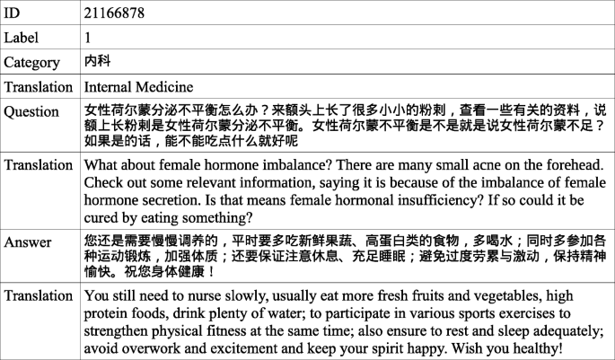
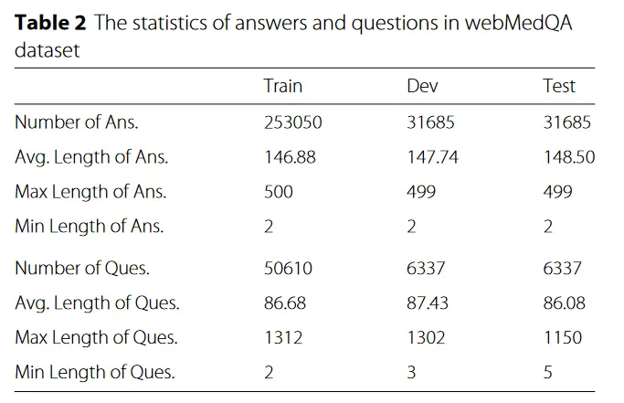
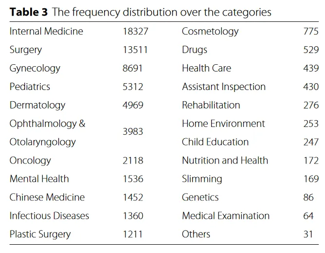
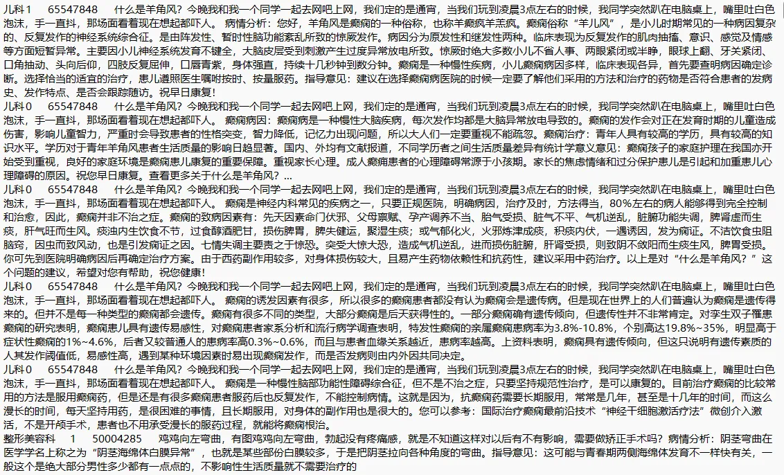

# webMedQA

<div align="center">
    <a href="https://github.com/openmedlab/"></a>
</div>
<p style="text-align:center;font-size:10px;"><em></em></p>

## Dataset Information

The webMedQA dataset is a dataset built specifically for Chinese medical question-answering (QA) tasks, aimed at promoting research and applications in the relevant fields. Proposed by the Chinese Academy of Sciences in their 2019 study, it collects health questions from users and answers from doctors or enthusiastic users from professional health consultation websites such as Baidu Doctor and 120Ask. These questions cover various clinical departments, including internal medicine, surgery, gynecology, pediatrics, and more, totaling 63,284 questions. The dataset has been pre-processed to remove all web tags, links, and garbled text, retaining only numbers, punctuation, Chinese and English characters. In addition, for the study of answer ranking and recommendation, four negative answers were randomly sampled for each question.

The webMedQA dataset is characterized by its scale and diversity; it contains a large number of medical questions and answers and covers a wide range of medical fields. The construction of this dataset is of great significance for advancing the research of Chinese medical text processing and related fields. With this dataset, researchers can develop and test new medical QA systems, improving the accuracy and efficiency of automated medical QA. Moreover, the public release of the webMedQA dataset also provides a common platform for global researchers to compare and improve existing medical QA models.

## Dataset Meta Information

| Task Type | Language | Train | Val | Test | File Format | Size |
|-----------|----------|-------|----|------|-------------|------|
| QA        | Chinese  | 50610 | 6337   | 6337  | txt         | 71MB |


## Dataset Information Statistics

<div align="center">
    <a href="https://github.com/openmedlab/"></a>
</div>
<p style="text-align:center;font-size:10px;"><em></em></p>

Statistics on the length of questions and answers on the webMedQA data set show that the longest question is 1312 tokens, with an average of around 86 tokens; the longest answer is 500 tokens, with an average of around 146 tokens.

<div align="center">
    <a href="https://github.com/openmedlab/"></a>
</div>
<p style="text-align:center;font-size:10px;"><em></em></p>

Regarding the types of questions covered, the most were Internal Medicine and Surgery, and the least were Medical Examination and Others.

## Dataset Example

Each line in the txt file is an entry, and different fields are separated by \t. Each line includes four fields, namely department, ID, question, and answer. The picture below shows the data in the train set. You can see that the questions in the first five pieces of data are the same, but the answers are different. This is because one question in webMedQA corresponds to multiple answers (1 positive, 4 negative).

<div align="center">
    <a href="https://github.com/openmedlab/"></a>
</div>
<p style="text-align:center;font-size:10px;"><em>Official paper data example</em></p>

## File Structure

The data set file structure is as follows, divided into three zip files according to the division of training/validation/testing.

``` 
webMedQA
|__ train.zip
    |__ medQA_train.txt
|__ valid.zip
    |__ medQA_valid.txt
|__ test.zip
    |__ medQA_test.txt
```

## Authors and Institutions

Junqing He (University of Chinese Academy of Sciences)

Mingming Fu (University of Chinese Academy of Sciences)

Manshu Tu (University of Chinese Academy of Sciences)

## Source Information

Official Website: https://github.com/hejunqing/webMedQA/tree/master

Download Link: https://github.com/hejunqing/webMedQA/tree/master

Article Address: https://bmcmedinformdecismak.biomedcentral.com/articles/10.1186/s12911-019-0761-8

Publication Date: 2019

## Citation

``` 
@article{he2019applying,
  title={Applying deep matching networks to Chinese medical question answering: A study and a dataset},
  author={He, Junqing and Fu, Mingming and Tu, Manshu},
  journal={BMC Medical Informatics and Decision Making},
  volume={19},
  number={2},
  pages={52},
  year={2019},
  doi={10.1186/s12911-019-0761-8}
}
```

Original introduction article is [here](https://zhuanlan.zhihu.com/p/682003236).